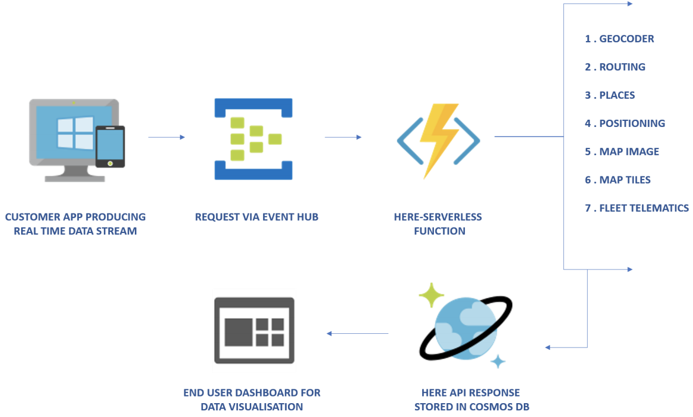

## HERE Location Services for Microsoft Azure

### Introduction

This project provides [Azure Functions](https://azure.microsoft.com/en-in/services/functions/) as **proxies** for several of the [HERE Location Services APIs](https://developer.here.com/documentation). These Azure Functions are packaged as per the [Azure Resource Manager Template](https://docs.microsoft.com/en-us/azure/azure-resource-manager/resource-group-overview).

The Azure Resource Manager Template (ARM Template) defines a simplified syntax for expressing serverless resources.

### Benefits

Azure Serverless Compute scales from none to thousands of concurrent functions almost instantly to match your workload, and reacts to events in near-real time. There are scenarios, where these functions can be integrated with front-end components, such as Event Hub or Service Bus, and back-end components, such as Cosmos DB, etc.

We welcome pull requests for anything, such as breaking, error handling, etc.

### Implementation Application Architecture

The following examples show the types of applications deployed with Azure Serverless Functions:

1. Data Streams ARM Template - uses Event Hub for real time data processing.

2. WebApp Backend ARM Template - uses Service Bus for request processing in batches.

### Requirements

You must obtain HERE API credentials to call HERE Maps APIs through the proxies in this project. You can start by obtaining a [Freemium plan](https://developer.here.com/plans?utm_medium=referral&utm_source=azure_marketplace_hlsfuntions&create=Freemium-Basic).

### List of APIs with Azure Functions Proxies

* [Geocoding and Search API v7](https://developer.here.com/documentation/geocoding-search-api/dev_guide/index.html.html)
* [Map Image API](https://developer.here.com/documentation/map-image/topics/introduction.html)
* [Map Tile API](https://developer.here.com/documentation/map-tile/topics/introduction.html)
* [Positioning API](https://developer.here.com/documentation/positioning/topics/introduction.html)
* [Routing API v8](https://developer.here.com/documentation/routing/topics/overview.html)
* [Fleet Telematics](https://developer.here.com/documentation/fleet-telematics/dev_guide/index.html)
* [Public Transit API v8](https://developer.here.com/documentation/public-transit/dev_guide/index.html)

### Setup

### Step 1: Register for an API Key

Visit the [HERE Location Suite Freemium Plan](https://developer.here.com/plans?utm_medium=referral&utm_source=azure_marketplace_hlsfuntions&create=Freemium-Basic) to obtain an `apikey`.

`apikey` is used to identify and authenticate your application.

### Step 2: Register for an Azure Account

Visit [Azure](https://azure.microsoft.com/free/) and sign up for a free account.

### Step 3: Install the Azure CLI

Download and install the [Azure CLI](https://docs.microsoft.com/en-us/cli/azure/install-azure-cli), and run `az login` by following the directions found in the  [Azure CLI User Guide](https://docs.microsoft.com/en-us/cli/azure/get-started-with-azure-cli?view=azure-cli-latest).

### Step 4: Get the Source

Clone [this repository](https://github.com/heremaps/here-azure-serverless) or download the ZIP file.

### Step 5: Build the Code

A build script is included at the root level in this repository. As a prerequisite, you must have the following tools installed on your machine:

* [NodeJS](https://nodejs.org) (Install an LTS version.)
* [Microsoft dotnet SDK](https://dotnet.microsoft.com/download)
* [Azure Functions Core tools 2.x](https://docs.microsoft.com/en-us/azure/azure-functions/functions-run-local)

`$ ./build.sh`

The build script creates a `dist` folder, where the required `npm packages` and the Azure extension are installed.

In summary, the build script installs:

1. Three Marketplace Offerings (a solution template and a ZIP file containing code and dependencies):

* Data Streams (provisions Event Hub, serverless functions, and Cosmos DB)
* WebApp Backend (provisions Service Bus, serverless functions, and Cosmos DB)
* Serverless Functions (provisions collection of HERE API functions)

2. Three ARM Templates (an ARM template and a ZIP file containing code and dependencies):

* Data Streams (provisions Event Hub, serverless functions, and Cosmos DB)
* WebApp Backend (provisions Service Bus, serverless functions, and  Cosmos DB)
* Serverless Functions (provisions collection of HERE API functions)

3. Seven individual serverless functions:

* These serverless functions are available in the serverless library.

Once the build is finished, the code ZIP files required for deployment can be found in the `dist/deployable` directory.

Refer to the following directories for more information:

* `azureMarketplacePublishing`: HERE uses this for publishing on Marketplace.
* `azureMarketplace`:  as `azureMarketplacePublishing`, can be used as part of an ARM template based deployment.
* `serverlesslibrary`: ZIP file for the seven serverless functions.

### Step 6: Deploy

Deployment can be performed using the locally available template or publicly accessible template links.

Code ZIP files created by the build script must be accessible through a public URL. Any hosting platform, including OneDrive, Google Drive, etc. can be used.

If you wish to utilize Azure Blob Storage, please refer to [Azure Blob Storage](https://docs.microsoft.com/en-us/azure/storage/blobs/storage-blobs-introduction) for more information.

The ARM Templates can be deployed in a number of ways:

* [Deploy Portal](https://docs.microsoft.com/en-us/azure/azure-resource-manager/resource-group-template-deploy-portal)
* [Deploy CLI](https://docs.microsoft.com/en-us/azure/azure-resource-manager/resource-group-template-deploy-cli)
* [Deploy PowerShell](https://docs.microsoft.com/en-us/azure/azure-resource-manager/resource-group-template-deploy)

### Function Access Key/Authorizatton

Azure functions support different access levels, and this project employs them as functions. As a result, each function has a different access key. However, a host key can also be used as a single key to access all functions deployed under the same function app.

You can find these keys under the "Manage" section of provisioned functions on the portal.

For more information, refer to [Azure Function HTTP Trigger & Bindings](https://docs.microsoft.com/en-us/azure/azure-functions/functions-bindings-http-webhook).

The following examples do not include keys. To provide a key, you use a URL parameter `&code=<function/host-key>` or add a HTTP header `x-functions-key` as part of the request.

### HERE Maps APIs with Function Proxies

Each of the HERE Maps APIs listed below has one Function as a proxy.
Below table shows how an existing HERE API URL can be mapped to Azure Function URL once deployed.

Individual API examples for each API are as shown below.

### Geocoding and Search API v7

URL Mapping

|API                  | HERE URL Prefix                                 |  Azure Function App URL Prefix |
|-------------------- |-------------------------------------------------|-----------------------------------------------------------|
|Discover             | `https://discover.search.hereapi.com/`          |  `https://<fnAppName>.azurewebsites.net/api/geocoder/` |
|Geocode              | `https://geocode.search.hereapi.com/`           |  `https://<fnAppName>.azurewebsites.net/api/geocoder/`
|Autosuggest          | `https://autosuggest.search.hereapi.com/`       |  `https://<fnAppName>.azurewebsites.net/api/geocoder/`
|Browse               | `https://browse.search.hereapi.com/`            |  `https://<fnAppName>.azurewebsites.net/api/geocoder/`
|Lookup               | `https://lookup.search.hereapi.com/`            |  `https://<fnAppName>.azurewebsites.net/api/geocoder/`
|Reverse Geocode      | `https://revgeocode.search.hereapi.com/`        |  `https://<fnAppName>.azurewebsites.net/api/geocoder/`

An example of an HTTP GET request to HERE Geocoding and Search API & equivalent AWS Lambda Proxy:

 An example of an HTTP GET request to discover API:
`https://discover.search.hereapi.com/v1/discover?apikey=<apikey>&at=42.36399,-71.05493&limit=1&q=restaurant&in=countryCode:USA` 

 To call the Function Proxy, replace the original URL with the API Gateway URL and change the Query String Parameters as shown in the following example. 

 An example of a HTTP GET request to the equivalent Azure Function Proxy: 

 `https://<fnAppName>.azurewebsites.net/api/geocoder/v1/discover?at=42.36399,-71.05493&limit=1&q=restaurant&in=countryCode:USA&code=<fncode>`

 An example of an HTTP GET request to HERE geocode API: 

 `https://geocode.search.hereapi.com/v1/geocode?apikey=<apikey>&q=5 Rue Daunou, 75000 Paris, France`

 To call the Function Proxy, replace the original URL with the API Gateway URL and change the Query String Parameters as shown in the following example. 

 An example of a HTTP GET request to the equivalent Azure Function Proxy: 

`https://<fnAppName>.azurewebsites.net/api/geocoder/v1/geocode?q=5 Rue Daunou, 75000 Paris, France&code=<fncode>`

An example of an HTTP GET request to HERE autosuggest API: 

`https://autosuggest.search.hereapi.com/v1/autosuggest?apikey=<apikey>&at=52.5199813,13.3985138&q=berlin bran`

To call the Function Proxy, replace the original URL with the API Gateway URL and change the Query String Parameters as shown in the following example. 

An example of a HTTP GET request to the equivalent Azure Function Proxy: 

`https://<fnAppName>.azurewebsites.net/api/geocoder/v1/autosuggest?at=52.5199813,13.3985138&q=berlin bran&code=<fncode>`

An example of an HTTP GET request to HERE browse API: 

`https://browse.search.hereapi.com/v1/browse?apikey=<apikey>&at=-23.000813,-43.351629&limit=2&categories=100-1100,200-2000-0011,100-1000`

To call the Function Proxy, replace the original URL with the API Gateway URL and change the Query String Parameters as shown in the following example. 

An example of a HTTP GET request to the equivalent Azure Function Proxy: 

`https://<fnAppName>.azurewebsites.net/api/geocoder/v1/browse?at=-23.000813,-43.351629&limit=2&categories=100-1100,200-2000-0011,100-1000&code=<fncode>`

 An example of an HTTP GET request to HERE lookup API: 

 `https://lookup.search.hereapi.com/v1/lookup?apikey=<apikey>& id=here:pds:place:276u0vhj-b0bace6448ae4b0fbc1d5e323998a7d2`

 To call the Function Proxy, replace the original URL with the API Gateway URL and change the Query String Parameters as shown in the following example. 

 An example of a HTTP GET request to the equivalent Azure Function Proxy: 

 `https://<fnAppName>.azurewebsites.net/api/geocoder/v1/lookup?id=here:pds:place:276u0vhj-b0bace6448ae4b0fbc1d5e323998a7d2&code=<fncode>`

 An example of an HTTP GET request to HERE revgeocode API: 

 `https://revgeocode.search.hereapi.com/v1/revgeocode?apikey=<apikey>&at=48.2181679%2C16.3899064&lang=en-US`

 To call the Function Proxy, replace the original URL with the API Gateway URL and change the Query String Parameters as shown in the following example. 

 An example of a HTTP GET request to the equivalent Azure Function Proxy: 

`https://<fnAppName>.azurewebsites.net/api/geocoder/v1/revgeocode?at=48.2181679%2C16.3899064&lang=en-US&code=<fncode>`

### Map Image API
URL Mapping

|API                  | HERE URL Prefix                                 |  Azure Function App URL Prefix |
|-------------------- |-------------------------------------------------|-----------------------------------------------------------|
|Images               | `https://image.ls.hereapi.com/`                 |  `https://<fnAppName>.azurewebsites.net/api/map_image/`

An example of a HTTP GET request to the HERE Map Image API:  
`https://image.ls.hereapi.com/mia/1.6/mapview?c=60.17675,24.929974&nodot&t=0&z=15&apikey=<apikey>`

To call the Function Proxy, replace the original URL with the API Gateway URL and change the Query String Parameters as shown in the following example.

An example of a HTTP GET request to the equivalent Azure Function Proxy:

`https://<fnAppName>.azurewebsites.net/api/map_image/mia/1.6/mapview?c=60.17675,24.929974&nodot&t=0&z=15&code=<fncode>`

### Map Tile API
URL Mapping

|API                  | HERE URL Prefix                                 |  Azure Function App URL Prefix |
|-------------------- |-------------------------------------------------|-----------------------------------------------------------|
|Traffic              | `https://{1-4}.traffic.maps.ls.hereapi.com/`    |  `https://<fnAppName>.azurewebsites.net/api/map_tile/traffic/`
|Base                 | `https://{1.4}.base.maps.ls.hereapi.com/`       |  `https://<fnAppName>.azurewebsites.net/api/map_tile/base/`
|Aerial               | `https://{1.4}.aerial.maps.ls.hereapi.com/`     |  `https://<fnAppName>.azurewebsites.net/api/map_tile/aerial/`

An example of a HTTP GET request to the HERE Traffic Map Tile API:  
`https://1.traffic.maps.ls.hereapi.com/maptile/2.1/traffictile/newest/normal.day/11/525/761/512/jpg?pview=ARG&apikey=<apikey>`

To call the Function Proxy, replace the original URL with the API Gateway URL and change the Query String Parameters as shown in the following example.

An example of a HTTP GET request to the equivalent Azure Function Proxy:

`https://<fnAppName>.azurewebsites.net/api/map_tile/traffic/maptile/2.1/traffictile/newest/normal.day/11/525/761/512/jpg?pview=ARG&code=<fncode>`

An example of a HTTP GET request to the HERE Base Map Tile API:  
`https://1.base.maps.ls.hereapi.com/maptile/2.1/maptile/newest/normal.day/13/4400/2686/256/png8?apiKey=<apiKey>`

To call the Function Proxy, replace the original URL with the API Gateway URL and change the Query String Parameters as shown in the following example.

An example of a HTTP GET request to the equivalent Azure Function Proxy:

`https://<fnAppName>.azurewebsites.net/api/map_tile/base/maptile/2.1/maptile/newest/normal.day/13/4400/2686/256/png8?code=<fncode>`

An example of a HTTP GET request to the HERE Aerial Map Tile API:  
`https://1.aerial.maps.ls.hereapi.com/maptile/2.1/labeltile/newest/hybrid.day/5/5/10/256/jpg?apiKey=<apiKey>`

To call the Function Proxy, replace the original URL with the API Gateway URL and change the Query String Parameters as shown in the following example.

An example of a HTTP GET request to the equivalent Azure Function Proxy:

`https://<fnAppName>.azurewebsites.net/api/map_tile/aerial/maptile/2.1/labeltile/newest/hybrid.day/5/5/10/256/jpg?code=<fncode>`

### HERE Positioning API

**Note:** this API call requires a HTTP **POST**. 
URL Mapping

|API                  | HERE URL Prefix                                 |  Azure Function App URL Prefix |
|-------------------- |-------------------------------------------------|-----------------------------------------------------------|
|Positioning          | `https://pos.ls.hereapi.com/positioning/`       |  `https://<fnAppName>.azurewebsites.net/api/positioning/`

An example of a HTTP POST request to the Positioning API: 

`curl -i -X POST -H 'Content-Type: application/json' -d  '{ "gsm": [ {"mcc": 262,"mnc": 1,"lac": 5126,"cid": 16504,"nmr": [{"bsic": "6","bcch": "82"},{"bsic": "7","bcch": "85"},{"bsic": "12","bcch": "93"},{"bsic": "13","bcch": "88"},{"bsic": "19","bcch": "88"}]}]}' https://pos.ls.hereapi.com/positioning/v1/locate?apikey=<apikey>`

An example of a HTTP POST request to the equivalent Azure Function Proxy:

`curl -i -X POST -H 'Content-Type: application/json' -d  '{ "gsm": [ {"mcc": 262,"mnc": 1,"lac": 5126,"cid": 16504,"nmr": [{"bsic": "6","bcch": "82"},{"bsic": "7","bcch": "85"},{"bsic": "12","bcch": "93"},{"bsic": "13","bcch": "88"},{"bsic": "19","bcch": "88"}]}]}' https://<fnAppName>.azurewebsites.net/api/positioning/v1/locate`

### HERE Routing API
URL Mapping

|API                  | HERE URL Prefix                                 |  Azure Function App URL Prefix |
|-------------------- |-------------------------------------------------|-----------------------------------------------------------|
|CalculateRoute       | `https://router.hereapi.com/`                 |  `https://<fnAppName>.azurewebsites.net/api/routing/`
|Routing(Isoline)     | `https://isoline.route.ls.hereapi.com/`       |  `https://<fnAppName>.azurewebsites.net/api/routing/isoline.route/`
|Routing(Matrix)      | `https://matrix.route.ls.hereapi.com/`        |  `https://<fnAppName>.azurewebsites.net/api/routing/matrix.route/`

 An example of an HTTP GET request to HERE CalculateRoute API:
 `https://router.hereapi.com/v8/routes?apikey=<apiKey>&transportMode=car&origin=52.5308,13.3847&destination=52.5323,13.3789&return=summary`

  To call the Lambda proxy instead, replace the original URL with the API Gateway URL, change the type, resourcePath and Query String Parameters as follows:

An example of a HTTP GET request to the equivalent Azure Function Proxy: 

`https://<fnAppName>.azurewebsites.net/api/routing/v8/routes/?transportMode=car&origin=52.5308,13.3847&destination=52.5323,13.3789&return=summary&code=<fncode>`

An example of an HTTP GET request to HERE Routing(Isoline) API:
 `https://isoline.route.ls.hereapi.com/routing/7.2/calculateisoline.json?apiKey=<apiKey>&mode=fastest%3Bpedestrian&start=52.5160%2C13.3778&rangetype=distance&range=2000`

  To call the Lambda proxy instead, replace the original URL with the API Gateway URL, change the type, resourcePath and Query String Parameters as follows:

An example of a HTTP GET request to the equivalent Azure Function Proxy: 

`https://<fnAppName>.azurewebsites.net/api/routing/7.2/calculateisoline.json?mode=fastest%3Bpedestrian&start=52.5160%2C13.3778&rangetype=distance&range=2000&code=<fncode>`

 An example of an HTTP GET request to HERE Routing(Matrix) API:
 `https://matrix.route.ls.hereapi.com/routing/7.2/calculatematrix.json?apiKey=<apiKey>&mode=fastest%3Btruck%3Btraffic%3Adisabled%3B&start0=40.7790%2C-73.9622&destination0=40.7482%2C-73.9860&destination1=40.7558%2C-73.9870&destination2=40.7054%2C-73.9961`

  To call the Lambda proxy instead, replace the original URL with the API Gateway URL, change the type, resourcePath and Query String Parameters as follows:

An example of a HTTP GET request to the equivalent Azure Function Proxy: 

`https://<fnAppName>.azurewebsites.net/api/routing/7.2/calculatematrix.json?mode=fastest%3Btruck%3Btraffic%3Adisabled%3B&start0=40.7790%2C-73.9622&destination0=40.7482%2C-73.9860&destination1=40.7558%2C-73.9870&destination2=40.7054%2C-73.9961&code=<fncode>`

 ### HERE Fleet Telematics
URL Mapping

|API                  | HERE URL Prefix                                 |  Azure Function App URL Prefix |
|-------------------- |-------------------------------------------------|-----------------------------------------------------------|
|Fleet Telematics     | `https://fleet.ls.hereapi.com/`                 |  `https://<fnAppName>.azurewebsites.net/api/fleet`

An example of a HTTP GET request to the HERE Fleet Telematics API:  
`https://fleet.ls.hereapi.com/2/calculateroute.json?apiKey=<apiKey>&waypoint0=50.112698%2C8.675777&waypoint1=48.544180%2C9.662530&mode=fastest%3Bcar%3Btraffic%3Adisabled`

To call the Function Proxy, replace the original URL with the API Gateway URL and change the Query String Parameters as shown in the following example.

An example of a HTTP GET request to the equivalent Azure Function Proxy:

`https://<fnAppName>.azurewebsites.net/api/fleet/2/calculateroute.json?waypoint0=50.112698%2C8.675777&waypoint1=48.544180%2C9.662530&mode=fastest%3Bcar%3Btraffic%3Adisabled&code=<fncode>`

### HERE Public Transit API V8
URL Mapping

|API                  | HERE URL Prefix                                 |  Azure Function App URL Prefix |
|-------------------- |-------------------------------------------------|-----------------------------------------------------------|
|Next Departures      | `https://transit.hereapi.com/v8/departures`     |  `https://<fnAppName>.azurewebsites.net/api/public_transit/departures`
|Station Search       | `https://transit.hereapi.com/v8/stations`       |  `https://<fnAppName>.azurewebsites.net/api/public_transit/stations`
|Routing              | `https://transit.hereapi.com/v8/routes`         |  `https://<fnAppName>.azurewebsites.net/api/public_transit/routes`

An example of a HTTP GET request to the HERE Next Departures API: 

`https://transit.hereapi.com/v8/departures?in=41.900138,12.501924;r=500&apikey=<apikey>`

To call the Function Proxy, replace the original URL with the API Gateway URL and change the Query String Parameters as shown in the following example.

An example of a HTTP GET request to the equivalent Azure Function Proxy:

`https://<fnAppName>.azurewebsites.net/api/public_transit/departures?in=41.900138,12.501924;r=500&code=<fncode>`

An example of a HTTP GET request to HERE Station Search API:  
`https:/transit.hereapi.com/v8/stations?apiKey=<apiKey>&in=41.90123,12.500912`

To call the Function Proxy, replace the original URL with the API Gateway URL and change the Query String Parameters as shown in the following example.

An example of a HTTP GET request to the equivalent Azure Function Proxy:

`https://<fnAppName>.azurewebsites.net/api/public_transit/stations?in=41.90123,12.500912&code=<fncode>`

An example of a HTTP GET request to the HERE Transit Routing API:  
`https://transit.hereapi.com/v8/routes?origin=14.46734,78.85423&destination=1.90096,12.50243&apikey=<apikey>`

To call the Function Proxy, replace the original URL with the API Gateway URL and change the Query String Parameters as shown in the following example.

An example of a HTTP GET request to the equivalent Azure Function Proxy:

`https://<fnAppName>.azurewebsites.net/api/public_transit/routes?origin=14.46734,78.85423&destination=1.90096,12.50243&code=<fncode>`

### License

Copyright (C) 2019 HERE Europe B.V.

See the [LICENSE](./LICENSE) file in the root of this project for license details.
