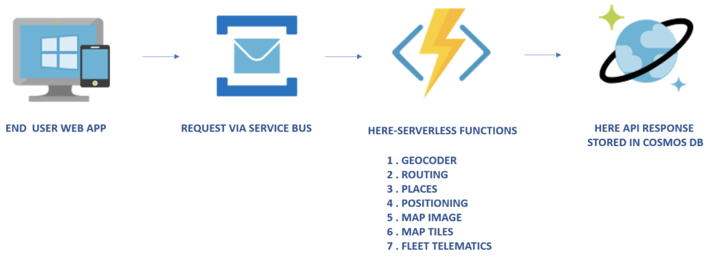

# HERE Location Services for Microsoft Azure

## Introduction

This project provides [Azure Functions](https://azure.microsoft.com/en-in/services/functions/) as **proxies** for several of the [HERE Location Services APIs](https://developer.here.com/documentation). These Azure Functions are packaged as per the [Azure Resource Manager Template](https://docs.microsoft.com/en-us/azure/azure-resource-manager/resource-group-overview).

The Azure Resource Manager Template (ARM Template) defines a simplified syntax for expressing serverless resources.

### Benefits

Azure Serverless Compute scales from none to thousands of concurrent functions almost instantly to match your workload, and reacts to events in near-real time. There are scenarios, where these functions can be integrated with front-end components, such as Event Hub or Service Bus, and back-end components, such as Cosmos DB, etc.

We welcome pull requests for anything, such as breaking, error handling, etc.

### Implementation Application Architecture

The following examples show the types of applications deployed with Azure Serverless Functions:

1. Data Streams ARM Template - uses Event Hub for real time data processing.

2. WebApp Backend ARM Template - uses Service Bus for request processing in batches.

## Requirements

You must obtain HERE API credentials to call HERE Maps APIs through the proxies in this project. You can start by obtaining a [Freemium plan](https://developer.here.com/plans?utm_medium=referral&utm_source=azure_marketplace_hlsfuntions&create=Freemium-Basic).

## List of APIs with Azure Functions Proxies

* [Geocoding](https://developer.here.com/documentation/geocoder/topics/introduction.html)
* [Map Image](https://developer.here.com/documentation/map-image/topics/introduction.html)
* [Map Tile](https://developer.here.com/documentation/map-tile/topics/introduction.html)
* [Places](https://developer.here.com/documentation/places/topics/introduction.html)
* [Positioning](https://developer.here.com/documentation/positioning/topics/introduction.html)
* [Routing](https://developer.here.com/documentation/routing/topics/overview.html)
* [Fleet Telematics](https://developer.here.com/documentation/fleet-telematics/dev_guide/index.html)

## Setup

### Step 1: Register for an API Key

Visit the [HERE Location Suite Freemium Plan](https://developer.here.com/plans?utm_medium=referral&utm_source=azure_marketplace_hlsfuntions&create=Freemium-Basic) to obtain an `apikey` OR `app_id` and `app_code`.

`apikey` is used to identify and authenticate your application.
`app_id` uniquely identifies your application.
`app_code` is used in the authentication process to identify a session.

### Step 2: Register for an Azure Account

Visit [Azure](https://azure.microsoft.com/free/) and sign up for a free account.

### Step 3: Install the Azure CLI

Download and install the [Azure CLI](https://docs.microsoft.com/en-us/cli/azure/install-azure-cli), and run `az login` by following the directions found in the  [Azure CLI User Guide](https://docs.microsoft.com/en-us/cli/azure/get-started-with-azure-cli?view=azure-cli-latest).

### Step 4: Get the Source

Clone [this repository](https://github.com/heremaps/here-azure-serverless) or download the ZIP file.

### Step 5: Build the Code

A build script is included at the root level in this repository. As a prerequisite, you must have the following tools installed on your machine:

* [NodeJS](https://nodejs.org) (Install an LTS version.)
* [Microsoft dotnet SDK](https://dotnet.microsoft.com/download)
* [Azure Functions Core tools 2.x](https://docs.microsoft.com/en-us/azure/azure-functions/functions-run-local)

`$ ./build.sh`

The build script creates a `dist` folder, where the required `npm packages` and the Azure extension are installed.

In summary, the build script installs:

1. Three Marketplace Offerings (a solution template and a ZIP file containing code and dependencies):

* Data Streams (provisions Event Hub, serverless functions, and Cosmos DB)
* WebApp Backend (provisions Service Bus, serverless functions, and Cosmos DB)
* Serverless Functions (provisions collection of HERE API functions)

2. Three ARM Templates (an ARM template and a ZIP file containing code and dependencies):

* Data Streams (provisions Event Hub, serverless functions, and Cosmos DB)
* WebApp Backend (provisions Service Bus, serverless functions, and  Cosmos DB)
* Serverless Functions (provisions collection of HERE API functions)

3. Seven individual serverless functions:

* These serverless functions are available in the serverless library.

Once the build is finished, the code ZIP files required for deployment can be found in the `dist/deployable` directory.

Refer to the following directories for more information:

* `azureMarketplacePublishing`: HERE uses this for publishing on Marketplace.
* `azureMarketplace`:  as `azureMarketplacePublishing`, can be used as part of an ARM template based deployment.
* `serverlesslibrary`: ZIP file for the seven serverless functions.

### Step 6: Deploy

Deployment can be performed using the locally available template or publicly accessible template links.

Code ZIP files created by the build script must be accessible through a public URL. Any hosting platform, including OneDrive, Google Drive, etc. can be used.

If you wish to utilize Azure Blob Storage, please refer to [Azure Blob Storage](https://docs.microsoft.com/en-us/azure/storage/blobs/storage-blobs-introduction) for more information.

The ARM Templates can be deployed in a number of ways:

* [Deploy Portal](https://docs.microsoft.com/en-us/azure/azure-resource-manager/resource-group-template-deploy-portal)
* [Deploy CLI](https://docs.microsoft.com/en-us/azure/azure-resource-manager/resource-group-template-deploy-cli)
* [Deploy PowerShell](https://docs.microsoft.com/en-us/azure/azure-resource-manager/resource-group-template-deploy)

### Function Access Key/Authorizatton

Azure functions support different access levels, and this project employs them as functions. As a result, each function has a different access key. However, a host key can also be used as a single key to access all functions deployed under the same function app.

You can find these keys under the "Manage" section of provisioned functions on the portal.

For more information, refer to [Azure Function HTTP Trigger & Bindings](https://docs.microsoft.com/en-us/azure/azure-functions/functions-bindings-http-webhook).

The following examples do not include keys. To provide a key, you use a URL parameter `&code=<function/host-key>` or add a HTTP header `x-functions-key` as part of the request.

## HERE Maps APIs with Function Proxies

Each of the HERE Maps APIs listed below has one Function as a proxy.
Below table shows how an existing HERE API URL can be mapped to Azure Function URL once deployed.

Individual API examples for each API are as shown below.

### Geocoding API
URL Mapping

|API                  | HERE URL Prefix                                 |  Azure Function App URL Prefix |
|-------------------- |-------------------------------------------------|-----------------------------------------------------------|
|Geocoder             | `https://geocoder.ls.hereapi.com/`              |  `https://<fnAppName>.azurewebsites.net/api/geocoder/` |
|Geocoder             | `https://geocoder.api.here.com/`                |  `https://<fnAppName>.azurewebsites.net/api/geocoder/`

An example of a HTTP GET request to the HERE Geocoder API:  
`https://geocoder.ls.hereapi.com/6.2/geocode.json?searchtext=425+W+Randolph+Chicago&apikey=<apikey>`  

`https://geocoder.api.here.com/6.2/geocode.json?searchtext=425+W+Randolph+Chicago&appID=<appID>&app_code=<appCode>`   

To call the Function Proxy, replace the original URL with the API Gateway URL and change the Query String Parameters as shown in the following example. 

An example of a HTTP GET request to the equivalent Azure Function Proxy: 

`https://<fnAppName>.azurewebsites.net/api/geocoder/6.2/geocode.json?searchtext=425+W+Randolph+Chicago`

### Map Image API
URL Mapping

|API                  | HERE URL Prefix                                 |  Azure Function App URL Prefix |
|-------------------- |-------------------------------------------------|-----------------------------------------------------------|
|Images               | `https://image.ls.hereapi.com/`                 |  `https://<fnAppName>.azurewebsites.net/api/map_image/`
|Images               | `https://image.maps.api.here.com/`              |  `https://<fnAppName>.azurewebsites.net/api/map_image/`

An example of a HTTP GET request to the HERE Map Image API:  
`https://image.ls.hereapi.com/mia/1.6/mapview?c=60.17675,24.929974&nodot&t=0&z=15&apikey=<apikey>`

`https://image.maps.api.here.com/mia/1.6/mapview?c=60.17675,24.929974&nodot&t=0&z=15&app_id=<appID>&app_code=<appCode>`

To call the Function Proxy, replace the original URL with the API Gateway URL and change the Query String Parameters as shown in the following example.

An example of a HTTP GET request to the equivalent Azure Function Proxy:

`https://<fnAppName>.azurewebsites.net/api/map_image/mia/1.6/mapview?c=60.17675,24.929974&nodot&t=0&z=15`

### Map Tile API
URL Mapping

|API                  | HERE URL Prefix                                 |  Azure Function App URL Prefix |
|-------------------- |-------------------------------------------------|-----------------------------------------------------------|
|MapTile              | `https://{1-4}.traffic.maps.ls.hereapi.com/`    |  `https://<fnAppName>.azurewebsites.net/api/map_tile/traffic/`
|MapTile              | `https://{1-4}.traffic.maps.api.here.com/`      |  `https://<fnAppName>.azurewebsites.net/api/map_tile/traffic/`
|MapTile              | `https://{1.4}.base.maps.ls.hereapi.com/`       |  `https://<fnAppName>.azurewebsites.net/api/map_tile/base/`
|MapTile              | `https://{1.4}.base.maps.api.here.com/`         |  `https://<fnAppName>.azurewebsites.net/api/map_tile/base/`

An example of a HTTP GET request to the HERE Map Tile API:  
`https://1.traffic.maps.ls.hereapi.com/maptile/2.1/traffictile/newest/normal.day/11/525/761/512/jpg?pview=ARG&apikey=<apikey>`

`https://1.traffic.maps.api.here.com/maptile/2.1/traffictile/newest/normal.day/11/525/761/512/jpg?pview=ARG&app_id=<app_id&app_code=<app_code>`

To call the Function Proxy, replace the original URL with the API Gateway URL and change the Query String Parameters as shown in the following example.

An example of a HTTP GET request to the equivalent Azure Function Proxy:

`https://<fnAppName>.azurewebsites.net/api/map_tile/traffic/maptile/2.1/traffictile/newest/normal.day/11/525/761/512/jpg?pview=ARG`

The Azure Function Proxy URL depends on the base URL type. For example:

* https://1.traffic.maps.api.here.com/maptile/2.1/traffictile/newest

    Base URL: traffic

    Function Proxy URL: /api/map_tile/traffic/

* https://1.base.maps.api.here.com/maptile/2.1/streettile

    Base URL: base

    Function Proxy URL: /api/map_tile/base/

### Places API
URL Mapping

|API                  | HERE URL Prefix                                 |  Azure Function App URL Prefix |
|-------------------- |-------------------------------------------------|-----------------------------------------------------------|
|Places               | `https://places.api.here.com/places/`           |  `https://<fnAppName>.azurewebsites.net/api/places/`
|Places               | `https://places.ls.hereapi.com/places/`         |  `https://<fnAppName>.azurewebsites.net/api/places/`

An example of a HTTP GET request to the HERE Places API:  
`https://places.ls.hereapi.com/places/v1/autosuggest?q=NCL&in=19.6344,74.2931;r=131600;&size=3&apikey=<apikey>`

`https://places.api.here.com/places/v1/autosuggest?q=NCL&in=19.6344,74.2931;r=131600;&size=3&app_id=<appID>&app_code=<appCode>`

To call the Function Proxy, replace the original URL with the API Gateway URL and change the Query String Parameters as shown in the following example.

An example of a HTTP GET request to the equivalent Azure Function Proxy:

`https://<fnAppName>.azurewebsites.net/api/places/v1/autosuggest?q=NCL&in=19.6344,74.2931;r=131600;&size=3`

### HERE Positioning API

**Note:** this API call requires a HTTP **POST**. 
URL Mapping

|API                  | HERE URL Prefix                                 |  Azure Function App URL Prefix |
|-------------------- |-------------------------------------------------|-----------------------------------------------------------|
|Positioning          | `https://pos.ls.hereapi.com/positioning/`       |  `https://<fnAppName>.azurewebsites.net/api/positioning/`
|Positioning          | `https://pos.api.here.com/positioning/`         |  `https://<fnAppName>.azurewebsites.net/api/positioning/`

An example of a HTTP POST request to the Positioning API: 

`curl -i -X POST -H 'Content-Type: application/json' -d  '{ "gsm": [ {"mcc": 262,"mnc": 1,"lac": 5126,"cid": 16504,"nmr": [{"bsic": "6","bcch": "82"},{"bsic": "7","bcch": "85"},{"bsic": "12","bcch": "93"},{"bsic": "13","bcch": "88"},{"bsic": "19","bcch": "88"}]}]}' https://pos.ls.hereapi.com/positioning/v1/locate?&app_id=<app_id>&apikey=<apikey>`

`curl -i -X POST -H 'Content-Type: application/json' -d  '{ "gsm": [ {"mcc": 262,"mnc": 1,"lac": 5126,"cid": 16504,"nmr": [{"bsic": "6","bcch": "82"},{"bsic": "7","bcch": "85"},{"bsic": "12","bcch": "93"},{"bsic": "13","bcch": "88"},{"bsic": "19","bcch": "88"}]}]}' https://pos.api.here.com/positioning/v1/locate?&app_id=<app_id>&app_code=<app_code>`

An example of a HTTP POST request to the equivalent Azure Function Proxy:

`curl -i -X POST -H 'Content-Type: application/json' -d  '{ "gsm": [ {"mcc": 262,"mnc": 1,"lac": 5126,"cid": 16504,"nmr": [{"bsic": "6","bcch": "82"},{"bsic": "7","bcch": "85"},{"bsic": "12","bcch": "93"},{"bsic": "13","bcch": "88"},{"bsic": "19","bcch": "88"}]}]}' https://<fnAppName>.azurewebsites.net/api/positioning/v1/locate`

### HERE Routing API
URL Mapping

|API                  | HERE URL Prefix                                 |  Azure Function App URL Prefix |
|-------------------- |-------------------------------------------------|-----------------------------------------------------------|
|Routing              | `https://route.ls.hereapi.com/`                 |  `https://<fnAppName>.azurewebsites.net/api/routing/`
|Routing              | `https://route.api.here.com/`                   |  `https://<fnAppName>.azurewebsites.net/api/routing/`

An example of a HTTP GET request to the HERE Routing API:  
`https://route.ls.hereapi.com/routing/7.2/calculateroute.xml?waypoint0=geo!52.5,13.4&waypoint1=geo!52.5,13.45&departure=now&mode=fastest;publicTransport&combineChange=true&apikey=<apikey>`

`https://route.api.here.com/routing/7.2/calculateroute.xml?waypoint0=geo!52.5,13.4&waypoint1=geo!52.5,13.45&departure=now&mode=fastest;publicTransport&combineChange=true&app_id=<app_id>&app_code=<app_code>`

To call the Function Proxy, replace the original URL with the API Gateway URL and change the Query String Parameters as shown in the following example.

An example of a HTTP GET request to the equivalent Azure Function Proxy: 

`https://<fnAppName>.azurewebsites.net/api/routing/7.2/calculateroute.xml?waypoint0=geo!52.5,13.4&waypoint1=geo!52.5,13.45&departure=now&mode=fastest;publicTransport&combineChange=true`

### HERE Fleet Telematics
URL Mapping

|API                  | HERE URL Prefix                                 |  Azure Function App URL Prefix |
|-------------------- |-------------------------------------------------|-----------------------------------------------------------|
|Fleet Telematics     | `https://fleet.ls.hereapi.com/`                 |  `https://<fnAppName>.azurewebsites.net/api/fleet`
|Fleet Telematics     | `https://fleet.api.here.com/`                   |  `https://<fnAppName>.azurewebsites.net/api/fleet`

An example of a HTTP GET request to the HERE Fleet Telematics API:  
`https://fleet.ls.hereapi.com/2/findsequence.json?departure=2018-12-20T16:52:00Z&destination1=40.7589836120605%2C-73.9747695922852;st:900;acc:mo09:30:00Z|fr12:00:00Z&destination2=40.5741%2C-74.3309;st:900;at:2018-12-25T16:00:00Z&mode=shortest;car&start=39.9558%2C-75.1820&end=40.0832%2C-74.0682&apikey=<apikey>`

`https://fleet.api.here.com/2/findsequence.json?departure=2018-12-20T16:52:00Z&destination1=40.7589836120605%2C-73.9747695922852;st:900;acc:mo09:30:00Z|fr12:00:00Z&destination2=40.5741%2C-74.3309;st:900;at:2018-12-25T16:00:00Z&mode=shortest;car&start=39.9558%2C-75.1820&end=40.0832%2C-74.0682&app_id=<appID>&app_code=<appCode>`

To call the Function Proxy, replace the original URL with the API Gateway URL and change the Query String Parameters as shown in the following example.

An example of a HTTP GET request to the equivalent Azure Function Proxy:

`https://<fnAppName>.azurewebsites.net/api/fleet/2/findsequence.json?departure=2018-12-20T16:52:00Z&destination1=40.7589836120605%2C-73.9747695922852;st:900;acc:mo09:30:00Z|fr12:00:00Z&destination2=40.5741%2C-74.3309;st:900;at:2018-12-25T16:00:00Z&mode=shortest;car&start=39.9558%2C-75.1820&end=40.0832%2C-74.0682`

## License

Copyright (C) 2019 HERE Europe B.V.

See the [LICENSE](./LICENSE) file in the root of this project for license details.
